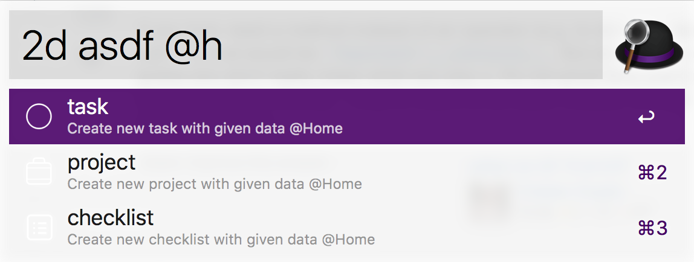
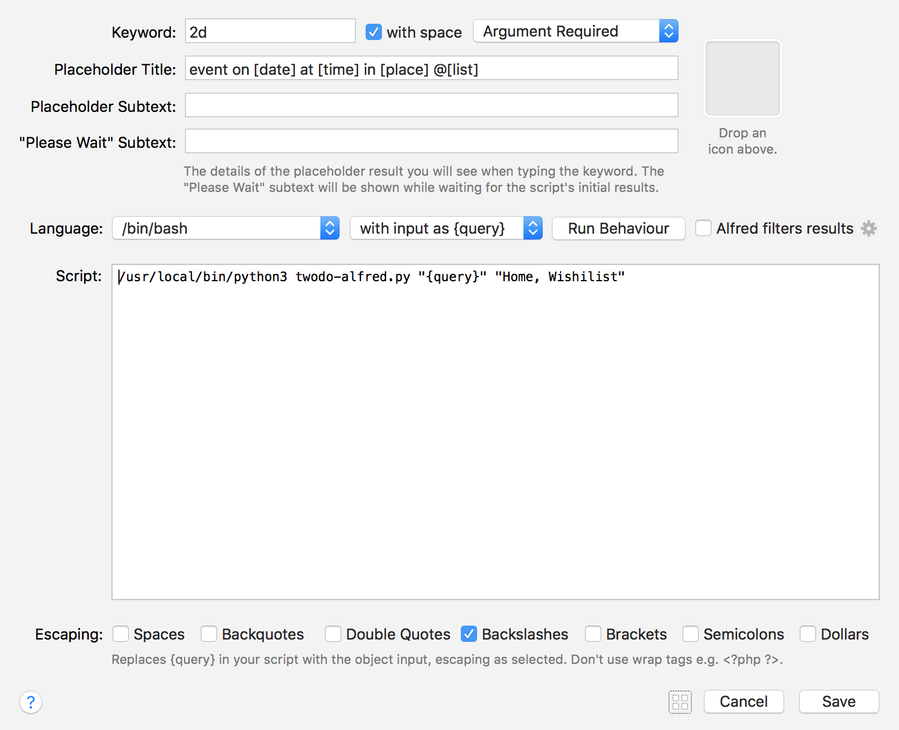
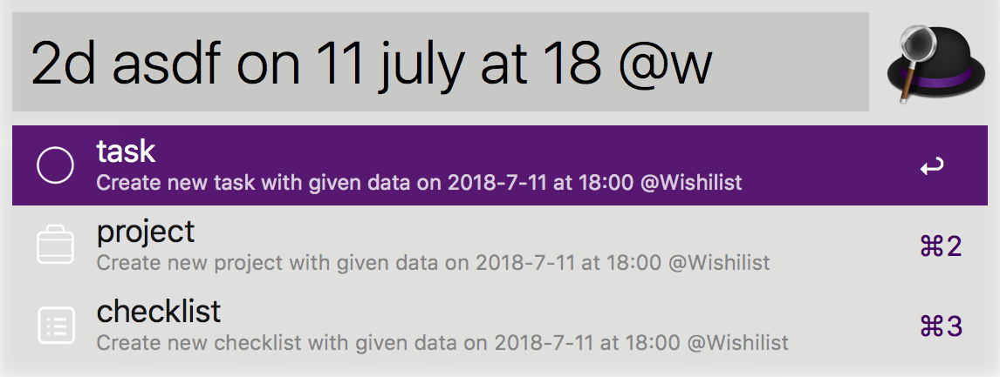

# alfred-2do

## by hylo
### (1) List name partial matching




If you manually enter your list names created in 2Do into Alfred's workflow page, it will try to match your partially typed list.

Currently, there is no way to retrieve list names from 2Do automatically.


```
/usr/local/bin/python3 twodo-alfred.py "{query}" "Home, Wishilist, Study"
```

### (2) next week

```
2d event ... on [wed][next wed][wednesday][next wednesday] ...
```

### (3) on-the-fly review of input



## Original README
Tried to mimic natural language to create a 2Do task.

USAGE:

```
2d event [[today][tomorrow] on [11][feb 11][11 feb 2018][wed][wednesday][2/11]] [at [9][9:30][pm]] [@[list]] [#[tag]] [[*][**][***]]
```

\+ This workflow will automatically detect and add webpage url currently you're watching as an action to open the webpage.

caveat: It takes bit of time for this script to dissect your input and understand your intention. So it is recommended you **pause 1 second before pressing return key** to create a new task. I'm looking for ways to solve this issue.

Many thanks to Fahad G. for providing icons :D Black icons are also included in case you're using light alfred theme. All the icons are edited based on original icon provided.

Also big shout out to [@doomsheart](https://github.com/doomsheart) reviewing the whole code for me.

Massive shout out to [@hylo](https://github.com/hylo926) for contribution.

based on the work of [2Do Workflow by Caleb Grove](https://www.alfredforum.com/topic/3811-2do-workflow/?do=findComment&comment=22721)

webpage detection code from [fallroot's copy-url-for-alfred](https://github.com/fallroot/copy-url-for-alfred)

[try at your own risk](https://github.com/Canorus/alfred-2do/raw/master/workflow/alfred-2Do_1.0-34.alfredworkflow) and any suggestions/pull requests will be appreciated

- [x] ~~only single tag is accepted; working on it~~
- [x] ~~priority~~

------

한국어 사용자는 따로 좀 더 상세하게 [적어두었습니다](https://canor.cf/2018/01/19/alfred-2do/)
